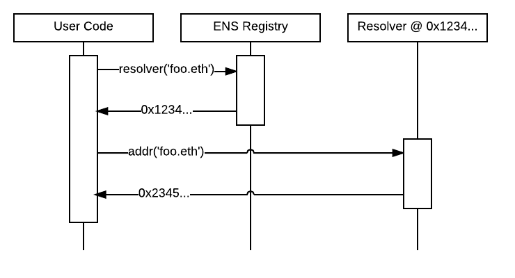

*******************
Implementer's Guide
*******************

This section is intended to provide guidance for anyone wanting to implement tools and applications that use ENS, or custom resolvers within ENS.

3 steps to add ENS to your application
======================================

ENS integration in an application encompasses several critical features, each of which can be implemented independently. While comprehensive ENS integration is ideal, even basic support can be a huge benefit to users. Below, we outline the three main ways you can add ENS support to your application, starting with the simplest and highest impact.

1. Accept ENS names anywhere your app accepts addresses
-------------------------------------------------------

The first step to supporting ENS in your application is making your application understand ENS names, and accepting them anywhere an address is accepted. To understand how to do this, see :ref:`resolving`.

If possible, when a user enters an ENS name instead of an address, remember the ENS name, not the address it currently resolves to. This makes it possible for users to update their ENS names and have applications they used the name in automatically resolve to the new address, in the same way that you would expect your browser to automatically direct you to the new IP address if a site you use changes servers.

If your application deals with user funds or other critical resources, you may want to keep track of the address a name resolves to and warn them when it changes, to ensure they are aware of the change.

2. Display ENS names anywhere your app shows addresses
------------------------------------------------------

The second step is to display ENS names wherever your app currently displays addresses.

If a user entered an ENS name in step 1, you should retain this name and show it to them whenever you would normally show the address.

If a user entered an address, or the address was obtained from elsewhere, you may still be able to show an ENS name, by doing :ref:`reverse`. This permits you to find the canonical name for an address and display that when possible. If no canonical name is provided, your application can fall back to displaying the address as it did previously.

3. Permit users to register names for their resources
-----------------------------------------------------

The final step for comprehensive ENS integration is to facilitate associating ENS names with resources created by or managed with your application. This can take two forms:

 1. Providing users with an easy way to register an ENS name and associate it with their resources (eg, wallet address); see :ref:`registrars`.
 2. Providing users with an easy way to update a name they own to point at your application's resources; see :ref:`record-updates`.

ENS libraries
=============

The following sections describe how to interact with ENS directly. Chances are, there is already an ENS library for your language of choice, that will do the heavy lifting for you. To find one, see :ref:`libraries`.

.. _resolving:

Resolving Names
===============

Resolving names in ENS is a three step process:

 1. Normalise and hash the name you want to resolve (see :ref:`namehash`).
 2. Query the ENS registry for the address of the resolver responsible for the name.
 3. Query the resolver for the resource you want to look up.

To query the registry, call the `resolver(bytes32)` method on the ENS registry contract (see :ref:`deployments` for details on where to find the registry), passing it the namehash of the normalised name you are querying for. The registry will return the address of the resolver responsible for that name, or 0 if no resolver is configured or the name does not exist.

If the registry returned a nonzero resolver address, you can then query the resolver for the resource you want to resolve. For instance, to look up the Ethereum address associated with the name, you would call the resolver's `addr(bytes32)` method, again passing in the namehash. The resolver will then return the resource requested, if it's available.

A list of currently recognised resource types are defined in EIP137_, but you can also define your own if you need. For details on how to do that, see :ref:`writing-resolvers`.

.. _reverse:

Reverse Resolution
==================

In addition to mapping names to resources (forward resolution), ENS also supports mapping from addresses to names and other metadata (reverse resolution).

Reverse records are named `<ethereum address>.addr.reverse` - for instance, the official registry would have its reverse records at `314159265dd8dbb310642f98f50c066173c1259b.addr.reverse`.

Reverse resolution follows the same three-step process as forward resolution; the only change is that the name you are resolving has the special format defined above. To find the canonical name for an address, then, you would first query the ENS registry for the resolver responsible for `(address).addr.reverse`, then call `name(bytes32)` on that resolver in order to obtain its canonical name.

`addr.reverse` has a registrar with `claim(address)`, `claimWithResolver(address, address)`, and `setName(string)` functions.

The claim function takes one argument, the Ethereum address that should own the reverse record.

This permits a very simple pattern for contracts that wish to delegate control of their reverse record to their creator; they simply need to add this function call to their constructor:

::

    reverseRegistrar.claim(msg.sender)

External accounts can also call this function to claim ownership of their reverse record. For simplicity, the `setName(string)` function permits claiming a record and configuring a canonical name all in one step.

.. _writing-resolvers:

Writing a resolver
==================

Resolvers are specified in EIP137_. A resolver must implement the following method:

.. code-block:: solidity

    function supportsInterface(bytes4 interfaceID) constant returns (bool)

`supportsInterface` is defined in EIP165_, and allows callers to determine if a resolver supports a particular record type. Record types are specified as a set of one or more methods that a resolver must implement together. Currently defined record types include:

+------------------+-------------+--------------+------------+
| Record type      | Function(s) | Interface ID | Defined in |
+==================+=============+==============+============+
| Ethereum address | `addr`      | 0x3b3b57de   | EIP137_    |
+------------------+-------------+--------------+------------+
| ENS Name         | `name`      | 0x691f3431   | EIP181_    |
+------------------+-------------+--------------+------------+
| ABI specification| `ABI`       | 0x2203ab56   | EIP205_    |
+------------------+-------------+--------------+------------+
| Public key       | `pubkey`    | 0xc8690233   | EIP619_    |
+------------------+-------------+--------------+------------+

`supportsInterface` must also return true for the `interfaceID` value `0x01ffc9a7`, which is the interface ID of `supportsInterface` itself.

Additionally, the `content()` interface is currently used as a defacto standard for Swarm hashes, pending standardisation, and has an interface ID of `0xd8389dc5`.

For example, a simple resolver that supports only the `addr` type might look something like this:

.. code-block:: solidity

    contract SimpleResolver {
        function supportsInterface(bytes4 interfaceID) constant returns (bool) {
            return interfaceID == 0x3b3b57de;
        }

        function addr(bytes32 nodeID) constant returns (address) {
            return address(this);
        }
    }

This trivial resolver always returns its own address as answer to all queries. Practical resolvers may use any mechanism they wish to determine what results to return, though they should be `constant`, and should minimise gas usage wherever possible.

NOTE: If you are resolving `addr()` records, you MUST treat a return value from the resolver of `0x00...00` as that record being unset. Failing to do so could result in users accidentally sending funds to the null address if they have configured a resolver in ENS, but not set the resolver record!

Resolving names onchain
=======================

Solidity libraries for onchain resolution are not yet available, but ENS resolution is straightforward enough it can be done trivially without a library. Contracts may use the following interfaces:

.. code-block:: solidity

    contract ENS {
        function owner(bytes32 node) constant returns (address);
        function resolver(bytes32 node) constant returns (Resolver);
        function ttl(bytes32 node) constant returns (uint64);
        function setOwner(bytes32 node, address owner);
        function setSubnodeOwner(bytes32 node, bytes32 label, address owner);
        function setResolver(bytes32 node, address resolver);
        function setTTL(bytes32 node, uint64 ttl);
    }

    contract Resolver {
        function addr(bytes32 node) constant returns (address);
    }

For resolution, only the `resolver()` function in the ENS contract is required; other methods permit looking up owners, and updating ENS from within a contract that owns a name.

With these definitions, looking up a name given its node hash is straightforward:

.. code-block:: solidity

    contract MyContract {
        ENS ens;

        function MyContract(address ensAddress) {
            ens = ENS(ensAddress);
        }

        function resolve(bytes32 node) constant returns(address) {
            var resolver = ens.resolver(node)
            return resolver.addr(node);
        }
    }

While it is possible for a contract to process a human-readable name into a node hash, we highly recommend working with node hashes instead, as they are easier to work with, and allow contracts to leave the complex work of normalising the name to their callers outside the blockchain. Where a contract always resolves the same names, those names may be converted to a node hash and stored in the contract as a constant.

.. _registrars:

Writing a registrar
===================

A registrar in ENS is simply any contract that owns a name, and allocates subdomains of it according to some set of rules defined in the contract code. A trivial first in first served contract is demonstrated below, using the ENS interface definition defined earlier.

.. code-block:: solidity

    contract FIFSRegistrar {
        ENS ens;
        bytes32 rootNode;

        function FIFSRegistrar(address ensAddr, bytes32 node) {
            ens = ENS(ensAddr);
            rootNode = node;
        }

        function register(bytes32 subnode, address owner) {
            var node = sha3(rootNode, subnode);
            var currentOwner = ens.owner(node);

            if (currentOwner != 0 && currentOwner != msg.sender) throw;

            ens.setSubnodeOwner(rootNode, subnode, owner);
        }
    }

You may wish to set custom rules for the allocation of new names to your users; the rules you set are entirely up to you.

You should also bear in mind that as long as you retain ownership of the parent name - either directly or through another contract - your users have no guarantee that you will not take back ownership of their names and change what they resolve to. You may wish to consider committing ownership of the name to a contract that restricts your ability to control it. For an example of this, see ENSNow_.

.. _record-updates:

Updating ENS records
====================

Your application may wish to provide users with a means of updating names they own to point to resources your application provides or manages. Doing so follows a similar process to :ref:`resolving`:

1. Normalise and hash the name you want to resolve (see :ref:`namehash`).
2. Query the ENS registry for the address of the resolver responsible for the name.
3. Call the appropriate update method on the resolver.

Steps 1 and 2 are the same as in :ref:`resolving`. If step 2 fails to return a valid resolver address, you will need to inform your user and offer them alternatives - for instance, you can check if they own the name in question, and if they do, offer to configure a default resolver for them by calling `setResolver` on the ENS registry.

In step 3, call the method defined by the resolver profile  - standard profiles are listed in EIP137_. For instance, to set the address associated with the name, call `setAddr(bytes32, address)`, passing in the name hash of the name to update and the address you wish it to point to.

.. _namehash:

Namehash
========

Names in ENS are represented as 32 byte hashes, rather than as plain text. This simplifies processing and storage, while permitting arbitrary length domain names, and preserves the privacy of names onchain. The algorithm used to translate domain names into hashes is called namehash. The Namehash algorithm is defined in EIP137_.

In order to preserve the hierarchal nature of names, namehash is defined recursively, making it possible to derive the hash of a subdomain from the namehash of the parent domain and the name or hash of the subdomain label.

Terminology
-----------

 - **domain** - the complete, human-readable form of a name; eg, `'vitalik.wallet.eth'`.
 - **label** - a single component of a domain; eg, `'vitalik'`, `'wallet'`, or `'eth'`. A label may not contain a period ('.').
 - **label hash** - the output of the keccak-256 function applied to a label; eg, `keccak256('eth') = 0x4f5b812789fc606be1b3b16908db13fc7a9adf7ca72641f84d75b47069d3d7f0`.
 - **node** - the output of the namehash function, used to uniquely identify a name in ENS.

Algorithm
---------

First, a domain is divided into labels by splitting on periods ('.'). So, 'vitalik.wallet.eth' becomes the list ['vitalik', 'wallet', 'eth'].

The namehash function is then defined recursively as follows:

::

    namehash([]) = 0x0000000000000000000000000000000000000000000000000000000000000000
    namehash([label, …]) = keccak256(namehash(…), keccak256(label))

A sample implementation in Python is provided below.

::

    def namehash(name):
      if name == '':
        return '\0' * 32
      else:
        label, _, remainder = name.partition('.')
        return sha3(namehash(remainder) + sha3(label))

Normalising and validating names
--------------------------------

Before a name can be converted to a node hash using Namehash, the name must first be normalised and checked for validity - for instance, converting `fOO.eth` into `foo.eth`, and prohibiting names containing forbidden characters such as underscores. It is crucial that all applications follow the same set of rules for normalisation and validation, as otherwise two users entering the same name on different systems may resolve the same human-readable name into two different ENS names.

Applications using ENS and processing human-readable names must follow UTS46_ for normalisation and validation. Processing should be done with non-transitional rules, and with `UseSTD3ASCIIRules=true`.

The ethereum-ens_ Javascript library incorporates compliant preprocessing into its `validate` and `namehash` functions, so users of this library avoid the need to handle this manually.

Handling of ambiguous names
---------------------------

Because of the large number of characters in unicode, and the wide variety of scripts represented, inevitably there are different Unicode characters that are similar or even identical when shown in common fonts. This can be abused to trick users into thinking they are visiting one site or resource, when in fact they are visiting another. This is known as a `homoglyph attack`_.

User agents and other software that display names to users should take countermeasures against these attacks, such as by highlighting problematic characters, or showing warnings to users about mixed scripts. `Chromium's IDNA strategy`_ may serve as a useful reference for user-agent behaviour around rendering IDNA names.

.. _EIP137: https://github.com/ethereum/EIPs/issues/137
.. _EIP165: https://github.com/ethereum/EIPs/issues/165
.. _EIP181: https://github.com/ethereum/EIPs/issues/181
.. _EIP205: https://github.com/ethereum/EIPs/pull/205
.. _EIP619: https://github.com/ethereum/EIPs/pull/619
.. _ethereum-ens: https://www.npmjs.com/package/ethereum-ens
.. _UTS46: http://unicode.org/reports/tr46/
.. _`homoglyph attack`: https://en.wikipedia.org/wiki/Internationalized_domain_name#ASCII_spoofing_concerns
.. _`Chromium's IDNA strategy`: https://www.chromium.org/developers/design-documents/idn-in-google-chrome
.. _ENSNow: https://github.com/ensdomains/subdomain-registrar
