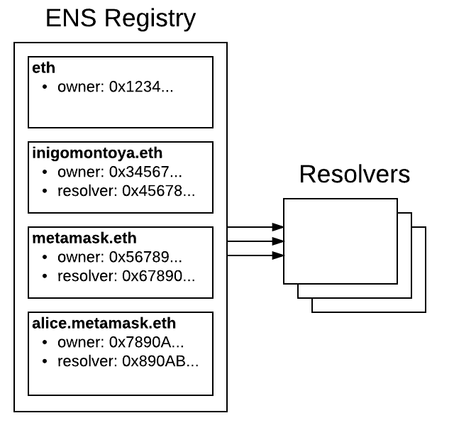

*******************
Introduction
*******************

ENS is the Ethereum Name Service, a distributed, open, and extensible naming system based on the Ethereum blockchain.

ENS's job is to map human-readable names like 'alice.eth' to machine-readable identifiers such as Ethereum addresses, content hashes, and metadata. ENS also supports 'reverse resolution', making it possible to associate metadata such as canonical names or interface descriptions with Ethereum addresses.

ENS has similar goals to DNS, the Internet's Domain Name Service, but has significantly different architecture, due to the capabilities and constraints provided by the Ethereum blockchain. Like DNS, ENS operates on a system of dot-separated hierarchial names called domains, with the owner of a domain having full control over the allocation of subdomains.

Top-level domains, like '.eth' and '.test' are owned by smart contracts called registrars, which specify rules governing the allocation of their subdomains. Anyone may, by following the rules imposed by these registrar contracts, obtain ownership of a second-level domain for their own use.

ENS in 5 minutes
================

ENS has two principal components: the registry, and resolvers.

The ENS registry consists of a single smart contract that maintains a list of all domains and subdomains, and stores three critical pieces of information about each:

 - The owner of the domain
 - The resolver for the domain
 - The time-to-live for all records under the domain

The owner of a domain may be either an external account (a user) or a smart contract. A registrar is simply a smart contract that owns a domain, and issues subdomains of that domain to users that follow some set of rules defined in the contract.

Owners of domains in the ENS registry may:

 - Set the resolver and TTL for the domain
 - Transfer ownership of the domain to another address
 - Change the ownership of subdomains

The ENS registry is deliberately straightforward, and exists only to map from a name to the resolver responsible for it.

Resolvers are responsible for the actual process of translating names into addresses. Any contract that implements the relevant standards may act as a resolver in ENS. General-purpose resolver implementations are offered for users whose requirements are straightforward, such as serving an infrequently changed address for a name.

Each record type - Ethereum address, Swarm content hash, and so forth - defines a method or methods that a resolver must implement in order to provide records of that kind. New record types may be defined at any time via the EIP standardisation process, with no need to make changes to the ENS registry or to existing resolvers in order to support them.

.. _deployments:

ENS on Ethereum
===============

ENS is deployed on mainnet at 0x314159265dd8dbb310642f98f50c066173c1259b_, where users may register names under the eth TLD, which uses an auction based registrar.

ENS is also deployed on the Ropsten testnet at 0x112234455c3a32fd11230c42e7bccd4a84e02010_. Users may register names under two top level domains:

 - .eth, which uses an auction based registrar with the same functionality as the main network, and allows users to keep names indefinitely; see :ref:`auctions`.
 - .test, which allows anyone to claim an unused name for test purposes, which expires after 28 days; see :ref:`fifs`.

ENS is also deployed on the Rinkeby testnet at 0xe7410170f87102df0055eb195163a03b7f2bff4a_, where only the .test top level domain is supported.

Resources
=========

 - EIP137_ - Ethereum Name Service
 - EIP162_ - Initial ENS Registrar Specification
 - ethereum-ens_ Javascript library
 - Nick's talk on ENS at DevCon 2: https://www.youtube.com/watch?v=pLDDbCZXvTE
 - DevCon 2 talk slides: https://arachnid.github.io/devcon2/#/title
 - Web interface for Ethereum enabled browsers: https://registrar.ens.domains

 .. _0x112234455c3a32fd11230c42e7bccd4a84e02010: https://ropsten.etherscan.io/address/0x112234455c3a32fd11230c42e7bccd4a84e02010
 .. _0x314159265dd8dbb310642f98f50c066173c1259b: https://etherscan.io/address/0x314159265dd8dbb310642f98f50c066173c1259b
 .. _0xe7410170f87102df0055eb195163a03b7f2bff4a: https://rinkeby.etherscan.io/address/0xe7410170f87102df0055eb195163a03b7f2bff4a
 .. _EIP137: https://github.com/ethereum/EIPs/issues/137
 .. _EIP162: https://github.com/ethereum/EIPs/issues/162
 .. _ethereum-ens: https://www.npmjs.com/package/ethereum-ens
